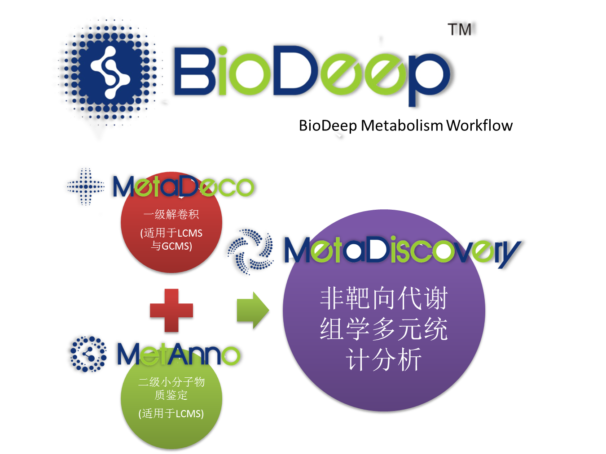

# The BioDeep User Guide

> The BioDeep platform user guide.

如果你在使用了BioDeepTM之后，认为BioDeep对您的工作有帮助，您可以在您的论文中引用：

> + 1.BioNovoGene. BioDeep/mzXML-web: BioDeep m/z math module. (2018). doi:10.5281/zenodo.1406730 

