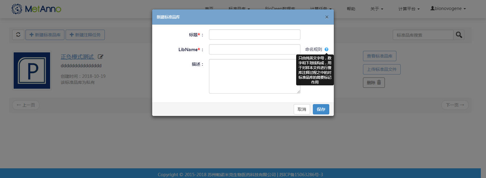
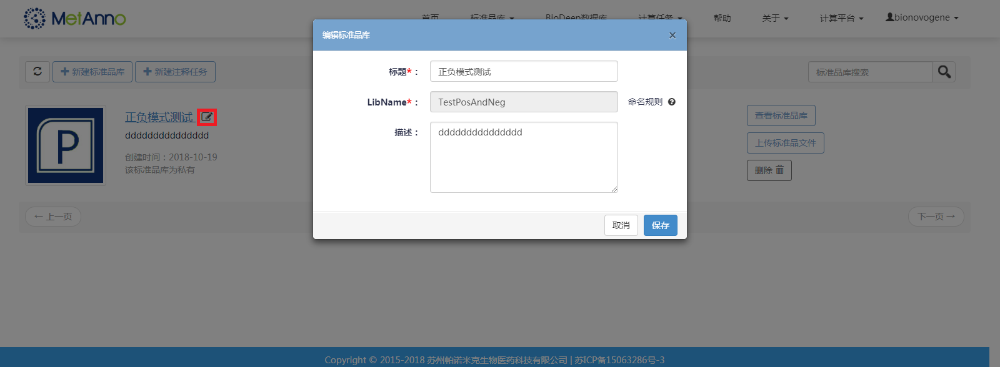
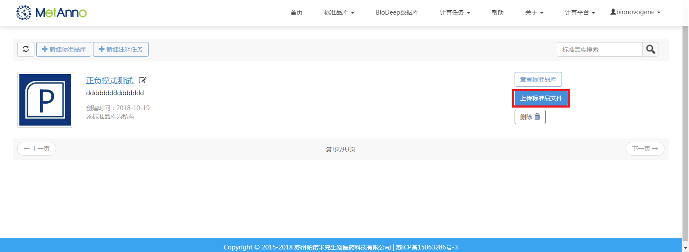

## **项目列表主页**

项目列表之中列举出了用户所创建的所有的标准品库的集合，一个分析项目指的是用户的一项课题项目。在每一个项目中，用户可以上传多组原始数据用来编译自己的标准品库项目的具体的实验内容。

### **创建项目和编辑项目**

用户可以直接点击页面的左上角的【+新增】按钮来创建新的标准品库；可以点击【删除】按钮将与该标准品库相关的注释信息文件，原始实验数据直接从服务器删除干净。点击了【+新增】按钮之后，网页将会跳出一个对话框，用户在其中输入标准品库的名称，LibName和摘要描述信息之后就可以创建一个分析项目了（其中，LibName在第一次输入后无法重新编辑，请用户慎重填写）。如果想要修改所保存的标准品库信息，可以点击标准品库的名称标题旁边的【修改】按钮重新编辑。

#### **新增标准品库**
点击【新增】，弹出新建对话框，填写标准品库标题，LibName及标准品库描述选填。 
 
 

 
 

#### **编辑标准品库**
点击标准品库标题右侧的编辑按钮，弹出编辑标准品库对话框，可以进行编辑标准品库标题，及编辑标准品库描述。 
 
 

 
 

#### **上传标准品文件**
编辑完项目信息之后，可以点击【上传标准品文件】按钮可以进入上传标品库文件页面进行注释信息文件，原始实验数据文件的上传操作： 
 
 

 
 
