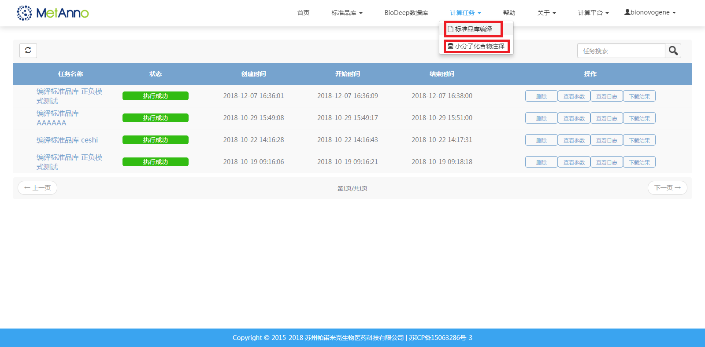
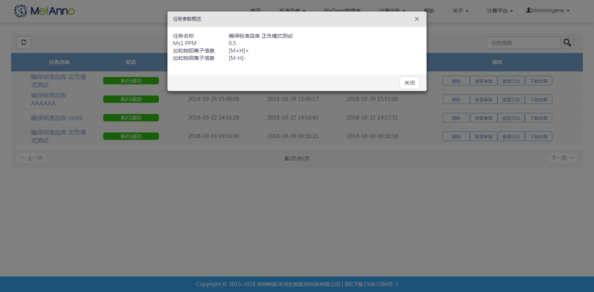
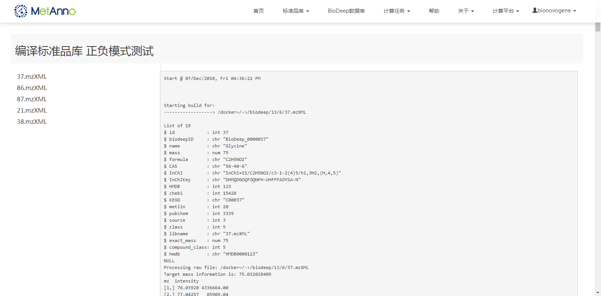
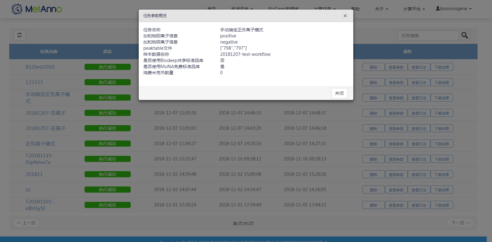
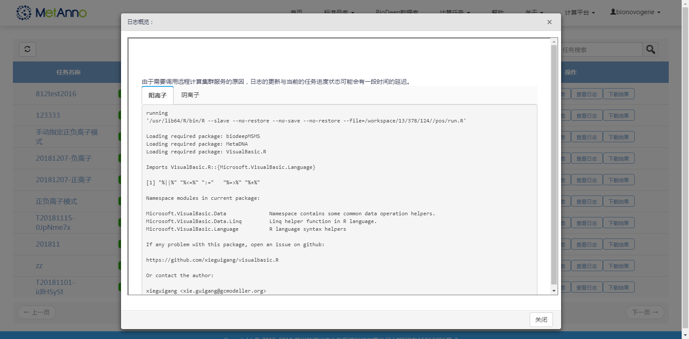
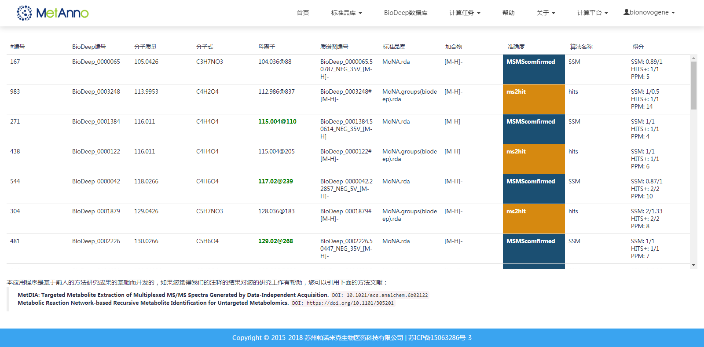

### **任务管理主页**

用户可以通过点击计算任务下的【标准品库编译】或者【小分子化合物注释】查看任务进度
 
 

 
 

**标准品库编译任务**

用户点击【查看参数】按钮可以显示编译该标准品库时所使用的参数信息
 
 

 
 

用户点击任务名称可以显示编译该标准品库时所记录的日志，（点击文件名称可以查看各文件编译的日志）
 
 

 
 

用户点击【下载结果】按钮可以下载编译该标准品库后的结果文件

**小分子化合物注释任务**

用户点击【查看参数】按钮可以显示创建该注释任务时所使用的参数信息
 
 

 
 

用户点击【查看日志】按钮可以显示该注释任务时所记录的日志
 
 

 
 

用户点击【下载结果】按钮可以下载该注释任务的结果文件

用户点击任务名称可以显示该注释任务结果
 
 

 
 